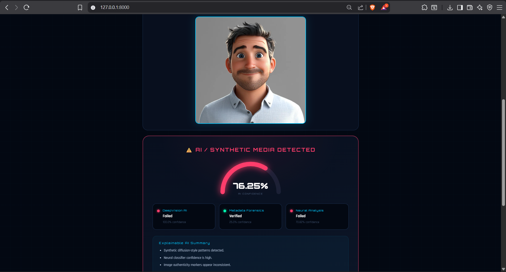
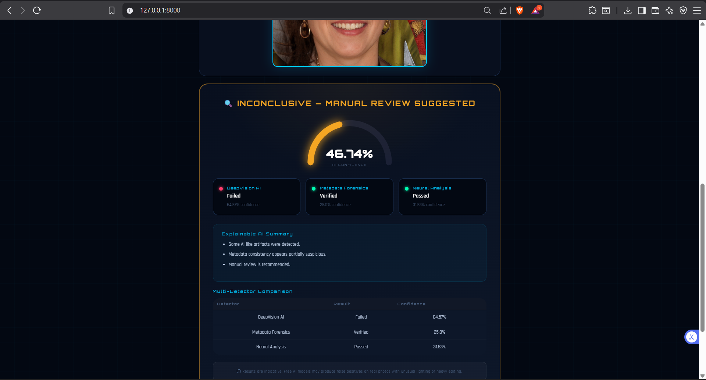
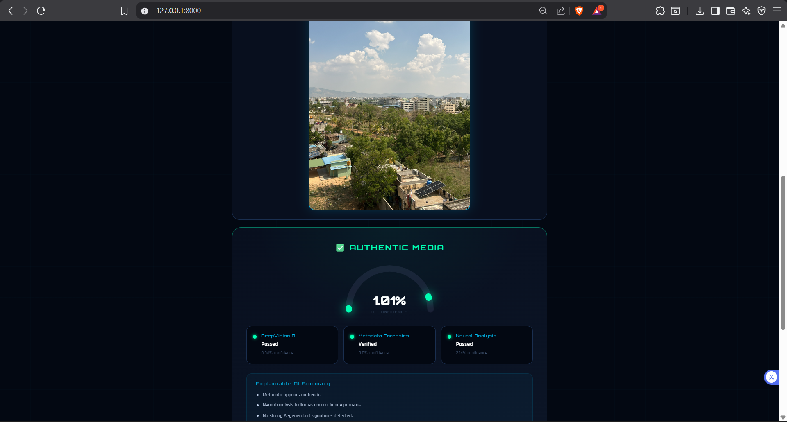

# 🛡️ AI Generated Media Detector

A tool that tells you whether an image or video is **AI generated or real** —
built entirely in Python.


---

## 📸 Screenshots

### 🔴 AI Detected


### 🟡 Inconclusive


### ✅ Authentic


### 🎨 Full Dashboard

---

## 💡 What Does It Do?

You upload a photo or video.
The app checks it using **3 different AI detectors at the same time.**
Within seconds it tells you:

- 🔴 **AI Generated** — this was made by an AI tool like Midjourney or Stable Diffusion
- 🟡 **Inconclusive** — not sure, needs a human to double check
- ✅ **Authentic** — looks like a real photo or video

---

## 🔍 The 3 Detectors

| # | Name | What it checks | Cost |
|---|---|---|---|
| 1 | DeepVision AI | Neural patterns from Stable Diffusion images | Free (HuggingFace) |
| 2 | Metadata Forensics | Hidden AI software signatures inside the file | Free (runs offline) |
| 3 | Neural Analysis | General AI vs real image classifier | Free (HuggingFace) |

All 3 run **at the same time** (not one by one) — this is the key technical feature.

---

## ⚡ The Key Technical Idea

Normally if you call 3 APIs one by one:
```
API 1 → wait 20s → API 2 → wait 0.1s → API 3 → wait 20s = 40 seconds total
```

This app runs all 3 at the same time using Python `asyncio`:
```
API 1 ──┐
API 2 ──┤──► all finish together = 20 seconds total
API 3 ──┘
```

**Same result. Half the time.** This is called concurrent programming.

---

## 🛠️ Built With

- **Python Shiny** — the web app framework
- **asyncio + httpx** — for running API calls at the same time
- **HuggingFace** — free AI models for detection
- **Pillow + piexif** — for reading hidden metadata inside images
- **OpenCV** — for pulling frames out of videos
- **Custom CSS** — the dark cyberpunk design

---

## 📊 How the Score is Calculated

Each detector gives a score from 0–100% (how likely it is AI).

The final score is a **weighted average:**
```
Final = (DeepVision × 50%) + (Neural × 30%) + (Metadata × 20%)
```

DeepVision gets the most weight because it's the most accurate for AI faces.

```
Final Score > 70%  →  🔴 AI Detected
Final Score 45–70% →  🟡 Inconclusive
Final Score < 45%  →  ✅ Authentic
```

---

## 🎨 UI Features

- Animated semi-circle arc showing the confidence score
- Colour changes — red for AI, orange for inconclusive, green for authentic
- Drag and drop — just drop your file onto the upload box
- Explainable AI — a plain English reason for every verdict
- Comparison table — shows each detector's result separately
- Video support — extracts the first frame and analyses it

---

## ⚠️ Honest Limitations

- First analysis takes 20–30 seconds (free AI models need to wake up)
- Can give wrong results on heavily edited real photos
- Video analysis only checks the first frame, not the whole video
- Overall accuracy is around 80% on clearly AI-generated images

---

## 🗺️ What I Would Add Next

- Deploy it online so anyone can use it without setup
- Check every frame of a video, not just the first one
- Save past results so you can compare over time
- Export results as a PDF report

---

## 👤 Made By

**Satya** 
- GitHub: [@Satya23BDS0326](https://github.com/Satya23BDS0326)
- LinkedIn: [www.linkedin.com/in/ballasatya]

---

